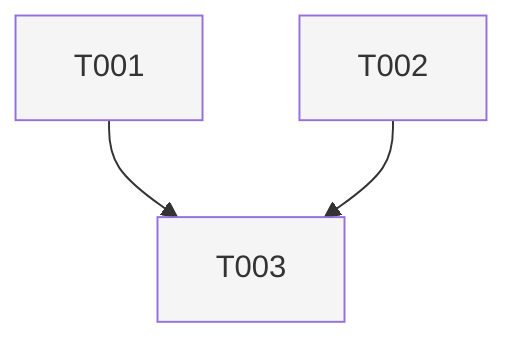

# Epic: <title>

## Summary

Short overview of scope and outcomes.

## Task list

| ID | Title | Depends on |
|----|-------|------------|
| T001 | (title) | none |
| T002 | (title) | T001 |

## Task dependency graph

Prerequisite direction: an edge from **A** to **B** means **B depends on A**
(A completes before B).

### Legend

Replace with bullets that map each stream to its color and task IDs, plus
merge nodes if used. For a single `defaultNode` style, one bullet is enough
(e.g. “All tasks: neutral gray fill”).

- Stream A (example): T001
- Stream B (example): T002
- Merge (example): T003
